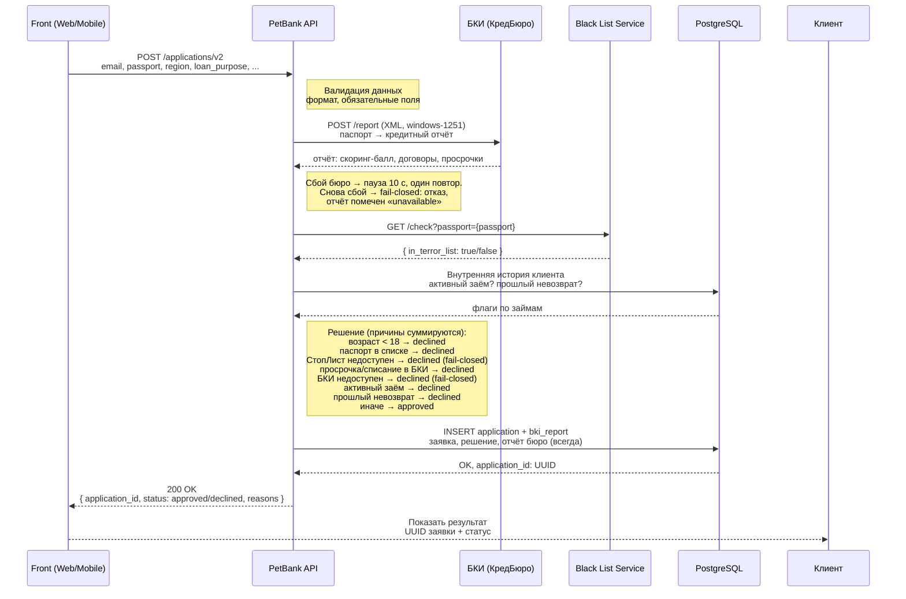

# PetBank

Учебный «банк». Сервер принимает заявку с персональными данными (ФИО, телефон, дата
рождения, страна) и возвращает решение: **approved** или **declined**.

Правила одобрения:
- заявителю должно быть от **18 до 35 лет** включительно;
- страна заявителя не должна быть в стоп-листе (по умолчанию — «Китай»).

## Как это работает (заявка v2)

Поток обработки `POST /applications/v2` — с проверкой паспорта по внешнему
СтопЛисту и сохранением в БД:



> Поддерживать в актуальном состоянии: при изменении ручек/полей/правил
> обновлять эту диаграмму.

## Стек

[FastAPI](https://fastapi.tiangolo.com/) + [Uvicorn](https://www.uvicorn.org/).
Нужен Python 3.8+ и установленные зависимости:

```bash
pip install -r requirements.txt
```

## Запуск

```bash
python app/src/main.py
# или другой порт:
python app/src/server.py 8080
```

В PyCharm можно просто нажать зелёную кнопку **Run** на `app/src/main.py`.

После старта в консоли появится:

```
PetBank запущен: http://localhost:8000  (Ctrl+C — остановить)
```

## Эндпоинты

| Метод | Путь            | Описание                          |
|-------|-----------------|-----------------------------------|
| POST  | `/applications` | Подать заявку, получить решение   |
| GET   | `/health`       | Проверка живости (liveness)       |
| GET   | `/ready`        | Готовность принимать трафик: БД отвечает (readiness) |
| GET   | `/`             | Короткая справка                  |

### POST /applications

Запрос:

```json
{
  "last_name": "Иванов",
  "first_name": "Иван",
  "middle_name": "Иванович",
  "phone": "+79991234567",
  "birth_date": "2000-05-15",
  "country": "Россия",
  "amount": 100000
}
```

Ответ (одобрено):

```json
{
  "application_id": "…uuid…",
  "status": "approved",
  "applicant": { "full_name": "Иванов Иван Иванович", "age": 26, "phone": "+79991234567" },
  "reasons": [],
  "received_at": "2026-06-05T16:52:00"
}
```

Если возраст вне диапазона 18–35 или страна — в стоп-листе, `status: "declined"`,
причины — в `reasons`.

## Как дёрнуть

**Postman:** проще всего импортировать контракт `app/resources/openapi.yaml`
(*Import → File → app/resources/openapi.yaml*) — Postman сам соберёт коллекцию с примерами.
Или вручную: `POST http://localhost:8000/applications`, Body → raw → JSON, тело как выше.

**PyCharm:** откройте `requests.http` и жмите ▶ над нужным запросом.

**curl:**

```bash
curl -X POST http://localhost:8000/applications \
  -H "Content-Type: application/json" \
  -d "{\"last_name\":\"Иванов\",\"first_name\":\"Иван\",\"phone\":\"+79991234567\",\"birth_date\":\"2000-05-15\",\"country\":\"Россия\"}"
```

**PowerShell:**

```powershell
$body = @{ last_name="Иванов"; first_name="Иван"; phone="+79991234567"; birth_date="2000-05-15"; country="Россия" } | ConvertTo-Json
Invoke-RestMethod -Uri http://localhost:8000/applications -Method Post -ContentType "application/json" -Body $body
```

## Файлы

Приложение — одна папка `app/` (её и заворачиваем в Docker-образ):

```
app/
├── src/                    # код
│   ├── main.py             # точка входа (запускает server.py)
│   ├── server.py           # сервер: бизнес-логика и эндпоинты
│   ├── logging_setup.py    # JSON-логи, request_id
│   ├── metrics.py          # Prometheus-метрики
│   ├── ratelimit.py        # rate limiter
│   ├── db.py               # подключение к Postgres
│   ├── models.py           # ORM-модели (SQLAlchemy)
│   └── repository.py       # сохранение user/application
└── resources/
    └── openapi.yaml        # контракт API (импорт в Postman)
```

В корне репозитория (в образ не идут): `requirements.txt`, `requests.http`,
`tests/`, миграции `alembic/` (применяются отдельной job `migrate.yml`).

## Защита под нагрузкой и SLO

`POST /applications` защищён от перегрузки (только эта ручка; `/health`,
`/metrics`, `/`, `/docs` не лимитируются):

- **Rate limiter** — глобальный token bucket. Сверх лимита → `429` +
  `Retry-After`. Метрика `petbank_rate_limited_total`.

Конфигурация (env, `0` = выключить):

| Переменная | По умолчанию | Назначение |
|---|---|---|
| `RATE_LIMIT_RPS` | `100` | Пополнение токенов (RPS) |
| `RATE_LIMIT_BURST` | `= RATE_LIMIT_RPS` | Ёмкость bucket (всплеск) |

**SLO:** при нагрузке до 100 RPS p95 латентности `/applications` ≤ 200 мс.
Наблюдается в Grafana (дашборд `petbank-business`, секция «SLO»).

## Куда расти

Новые правила одобрения добавляются в функцию `make_decision` в `app/src/server.py` —
дописывайте проверки и складывайте причины отказа в список `reasons`.

## Чёрный список паспортов (v2)

Ручка `POST /applications/v2` перед решением проверяет паспорт по внешнему сервису:

- `BLACK_LIST_URL` — базовый адрес сервиса (по умолчанию `http://212.147.238.3:8090`).
- `BLACK_LIST_TIMEOUT_SECONDS` — таймаут запроса к сервису в секундах
  (по умолчанию `0.8`).

Если сервис недоступен — заявка отклоняется (fail-closed).

## БКИ (внешнее бюро кредитных отчётов)

Ручка `POST /applications/v2` перед решением запрашивает кредитный отчёт у внешнего бюро:

- `BKI_URL` — базовый адрес БКИ (по умолчанию `http://212.147.238.3:8091`).
- `BKI_TIMEOUT_SECONDS` — таймаут запроса к бюро в секундах (по умолчанию `3.0`).
- `BKI_RETRY_DELAY_SECONDS` — пауза перед единственным повтором при сбое бюро
  (по умолчанию `10`; в тестах ставится `0`).
- `BKI_PARTNER_CODE` — код партнёра в запросе к бюро (по умолчанию `PETBANK`).

Если бюро недоступно после обеих попыток — заявка отклоняется (fail-closed), отчёт в БД помечается как «unavailable».

## Чёрно-ящичные интеграционные тесты

Тесты в `tests_blackbox/` поднимают весь стек в Docker (Postgres + мок СтопЛиста +
приложение из `Dockerfile`) и бьют по нему по реальному HTTP, ничего не импортируя
из кода. Они проверяют контракт ответов и саму интеграцию, а не конкретные пороги
бизнес-правил, поэтому переживают смену правил одобрения.

Каталог вынесен из `testpaths`, поэтому в обычный `pytest` он не попадает —
запускать нужно явно по пути:

```
pytest tests_blackbox/
```

В CI на **каждом PR** этот набор гоняется отдельным job **Integration tests
(black-box)** на реальном Docker-стеке — вместе с юнит-тестами и сборкой
Docker-образа. На PR проверяем по максимуму, чтобы поймать невалидное изменение
до мёржа.

Требования к хосту:
- запущенный Docker (например, `colima start`);
- на хосте установлены `alembic` и `httpx` (`pip install -r requirements-dev.txt`) —
  схема накатывается с хоста через `alembic upgrade head`;
- свободные порты: `8000`/`5432` (основной стенд) и `8001`/`5433` (строгий стенд
  для проверки rate-limit).

Если Docker не запущен, тесты помечаются как skipped, а не падают.
