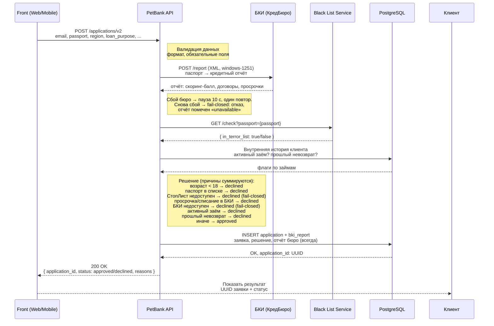

# План: пайплайн проверок БКИ → чёрный список → внутренняя БД

> **For agentic workers:** REQUIRED SUB-SKILL: Use superpowers:subagent-driven-development (recommended) or superpowers:executing-plans to implement this plan task-by-task. Steps use checkbox (`- [ ]`) syntax for tracking.

**Goal:** `POST /applications/v2` перед решением ходит в БКИ (XML windows-1251, ретрай, fail-closed), сохраняет отчёт бюро рядом с заявкой и отказывает по четырём новым правилам: текущая просрочка в БКИ, бюро недоступно, активный заём, прошлый невозврат.

> ⚠️ ИЗМЕНЕНИЕ 2026-07-03 (решение пользователя, после выполнения Task 1–3): сбой БКИ = **fail-closed** (отказ), а не fail-open. Задачи 1–3 не затронуты (клиент лишь возвращает `status="unavailable"`); правки внесены в Task 4, 5, 6, 7. Упоминания fail-open в коде-образцах Task 2 (докстринги bki.py) исправляются в Task 5.

**Architecture:** Два новых модуля по образцу `black_list.py`: чистый разбор протокола (`bki_parse.py`, без IO) и httpx-клиент с одним ретраем (`bki.py`). Новая таблица `bki_reports` (1:1 с заявкой, фичи колонками + сырой XML). Внешние вызовы — до транзакции БД; `make_decision_v2` переезжает внутрь транзакции (внутренние флаги требуют `user_id`).

**Tech Stack:** FastAPI, httpx (AsyncClient + MockTransport в тестах), SQLAlchemy async, Alembic, pytest + pytest-asyncio, prometheus_client, stdlib `xml.etree` и `http.server` (мок).

**Спека:** `docs/superpowers/specs/2026-07-02-bki-check-pipeline-design.md` — правила, протокол бюро, схема таблицы.

## Global Constraints

- Рабочая директория: worktree `~/Desktop/github/mybestpetfinancialproject/.claude/worktrees/feat+bki-check-pipeline`, ветка `feat/bki-check-pipeline`.
- Комментарии, докстринги, коммиты — по-русски; коммиты conventional (`feat:`/`test:`/`docs:`), каждый с трейлером `Co-Authored-By: Claude Opus 4.8 <noreply@anthropic.com>`.
- env новых компонентов: `BKI_URL` (дефолт `http://212.147.238.3:8091`), `BKI_TIMEOUT_SECONDS=3.0`, `BKI_RETRY_DELAY_SECONDS=10`, `BKI_PARTNER_CODE=PETBANK`.
- Суммы бюро храним в копейках (BigInteger), как отдаёт протокол.
- Наружный контракт ручки не меняется: 200 + `status`/`reasons`.
- Юнит/интеграционные тесты: `python -m pytest tests/ -q` из корня worktree (venv проекта: `source ../../../.venv/bin/activate` или `~/Desktop/github/mybestpetfinancialproject/.venv/bin/python -m pytest`). Blackbox гоняются отдельно и требуют Docker (colima) — в Task 6.
- Точность типов: фичи бюро — `BkiFeatures` (frozen dataclass из `bki_parse.py`); итог похода — `BkiOutcome` со `status ∈ {"ok","no_history","unavailable"}`.

---

### Task 1: `bki_parse.py` — чистый разбор протокола бюро

**Files:**
- Create: `app/src/bki_parse.py`
- Test: `tests/test_bki_parse.py`

**Interfaces:**
- Consumes: ничего (stdlib only).
- Produces (используют Task 2, 3, 4):
  - `BkiFeatures` — frozen dataclass: `score: int | None`, `n_contracts: int`, `has_writeoff: bool`, `has_current_delinquency: bool`, `overdue_amount_kop: int`, `max_dpd: int | None`, `n_late: int`, `debt_load_kop: int`, `inq_30: int | None`, `inq_90: int | None`, `inq_365: int | None`
  - `ParsedReport` — frozen dataclass: `result_code: int`, `features: BkiFeatures | None`
  - `build_request_xml(passport: str, partner_code: str) -> bytes`
  - `parse_report(raw: bytes) -> ParsedReport` (кидает `BkiRetryable` при КодРезультата=9, `BkiParseError` при битом XML)
  - исключения `BkiParseError(Exception)`, `BkiRetryable(Exception)`

- [ ] **Step 1: Написать падающие тесты**

Создать `tests/test_bki_parse.py`:

```python
"""Разбор протокола БКИ: XML windows-1251 → фичи. Примеры — из регламента бюро."""

import pytest

from bki_parse import (
    BkiParseError,
    BkiRetryable,
    build_request_xml,
    parse_report,
)


def _report_xml(inner: str) -> bytes:
    """Обёртка ответа бюро вокруг подставляемой середины."""
    xml = (
        '<?xml version="1.0" encoding="windows-1251"?>'
        '<КредитныйОтчетОтвет ВерсияФормата="2.4" КодУчастника="7742">'
        + inner +
        "</КредитныйОтчетОтвет>"
    )
    return xml.encode("windows-1251")


# Ответ с историей — структура примера 6.1 регламента (сокращён до сути).
FULL_REPORT = _report_xml(
    "<Служебная><ИдОтвета>x</ИдОтвета><КодРезультата>0</КодРезультата></Служебная>"
    '<Субъект><ФИО Фамилия="Сидоров" Имя="Dmitry"/></Субъект>'
    '<Скоринг><Балл Метод="SCR-11">702</Балл></Скоринг>'
    '<СведенияОбОбязательствах КоличествоДоговоров="3">'
    '<Договор НомерЗаписи="1"><Тип Код="6"/><Состояние Код="12"/>'
    '<Суммы Валюта="RUB"><СуммаОбязательства>32967400</СуммаОбязательства>'
    "<ПросроченнаяЗадолженность>0</ПросроченнаяЗадолженность></Суммы>"
    '<ПлатежнаяДисциплина Формат="СП-МЕС"><ПлтСтрока>1111A111</ПлтСтрока></ПлатежнаяДисциплина>'
    "</Договор>"
    '<Договор НомерЗаписи="2"><Тип Код="6"/><Состояние Код="13"/>'
    '<Суммы Валюта="RUB"><СуммаОбязательства>14112200</СуммаОбязательства>'
    "<ПросроченнаяЗадолженность>0</ПросроченнаяЗадолженность></Суммы>"
    '<ПлатежнаяДисциплина Формат="СП-МЕС"><ПлтСтрока>11X11</ПлтСтрока></ПлатежнаяДисциплина>'
    "</Договор>"
    '<Договор НомерЗаписи="3"><Тип Код="9"/><Состояние Код="52"/>'
    '<Суммы Валюта="RUB"><СуммаОбязательства>434900</СуммаОбязательства>'
    "<ПросроченнаяЗадолженность>434900</ПросроченнаяЗадолженность></Суммы>"
    '<ПлатежнаяДисциплина Формат="СП-МЕС"><ПлтСтрока>9</ПлтСтрока></ПлатежнаяДисциплина>'
    "</Договор>"
    "</СведенияОбОбязательствах>"
    '<ИнформационнаяЧасть><Запросы За30Дней="1" За90Дней="3" За12Месяцев="6"/></ИнформационнаяЧасть>'
)

# Ответ «истории нет» — пример 6.2 регламента.
NO_HISTORY = _report_xml(
    "<Служебная><КодРезультата>3</КодРезультата></Служебная>"
    "<Пояснение>СВЕДЕНИЯ ПО СУБЪЕКТУ В БЮРО НЕ НАЙДЕНЫ</Пояснение>"
)

RETRY_LATER = _report_xml("<Служебная><КодРезультата>9</КодРезультата></Служебная>")


def test_request_xml_splits_passport_and_encodes_cp1251():
    raw = build_request_xml("4512123456", "PETBANK")
    text = raw.decode("windows-1251")
    assert 'Серия="4512"' in text
    assert 'Номер="123456"' in text
    assert 'Код="PETBANK"' in text
    assert 'encoding="windows-1251"' in text


def test_full_report_features():
    parsed = parse_report(FULL_REPORT)
    assert parsed.result_code == 0
    f = parsed.features
    assert f.score == 702
    assert f.n_contracts == 3
    assert f.has_writeoff is True                # договор с Состояние=52
    assert f.has_current_delinquency is True     # 52 И просрочка > 0
    assert f.overdue_amount_kop == 434900
    assert f.max_dpd == 6                        # худший символ — «9»
    assert f.n_late == 2                         # «A» и «9»; «X» не считается
    assert f.debt_load_kop == 14112200 + 434900  # живой долг: Код 13 и 52/59 → 13 + 52
    assert (f.inq_30, f.inq_90, f.inq_365) == (1, 3, 6)


def test_no_history_has_no_features():
    parsed = parse_report(NO_HISTORY)
    assert parsed.result_code == 3
    assert parsed.features is None


def test_result_code_9_raises_retryable():
    with pytest.raises(BkiRetryable):
        parse_report(RETRY_LATER)


def test_broken_xml_raises_parse_error():
    with pytest.raises(BkiParseError):
        parse_report(b"<xml broken")


def test_missing_result_code_raises_parse_error():
    with pytest.raises(BkiParseError):
        parse_report(_report_xml("<Служебная></Служебная>"))
```

ВНИМАНИЕ к ожиданиям теста `test_full_report_features` — они фиксируют семантику:
`debt_load_kop` = сумма `СуммаОбязательства` договоров с живым долгом
(Состояние ∈ {13 активный, 59 просрочен, 52 списан-но-не-закрыт с долгом}) —
в примере это договоры 2 (13) и 3 (52): 14112200 + 434900. Погашенный (12) не входит.

- [ ] **Step 2: Убедиться, что тесты падают**

Run: `cd ~/Desktop/github/mybestpetfinancialproject/.claude/worktrees/feat+bki-check-pipeline && .venv/bin/python -m pytest tests/test_bki_parse.py -q 2>&1 | tail -3`
(если в worktree нет `.venv` — использовать `~/Desktop/github/mybestpetfinancialproject/.venv/bin/python`)
Expected: `ModuleNotFoundError: No module named 'bki_parse'`

- [ ] **Step 3: Реализовать `app/src/bki_parse.py`**

```python
"""Чистый разбор протокола БКИ «КредБюро»: XML windows-1251 → фичи.

Без IO и без httpx — только сборка запроса и разбор ответа, поэтому
тестируется на примерах из регламента бюро (ред. 2.4). Клиент — в bki.py.
"""

import xml.etree.ElementTree as ET
from dataclasses import dataclass


class BkiParseError(Exception):
    """Ответ бюро не удалось разобрать (битый XML / нет обязательных полей)."""


class BkiRetryable(Exception):
    """Бюро ответило «сервис временно недоступен» (КодРезультата=9)."""


# Ранг символа платёжной дисциплины (ПлтСтрока): чем выше — тем хуже.
# 1 — вовремя, A — просрочка 1–29 дн, 2–5 — 30+…120+, 9 — безнадёжный долг.
_PLT_RANK = {"1": 0, "A": 1, "2": 2, "3": 3, "4": 4, "5": 5, "9": 6}
# «Нет данных» — в ранжировании и подсчёте просрочек не участвует.
_PLT_SKIP = {"X", "0"}

# Состояния договора: 13 — активный, 12 — погашен, 59 — просрочен, 52 — списан.
_STATE_NEGATIVE = {"52", "59"}       # негатив в истории
_STATE_ALIVE = {"13", "52", "59"}    # долг ещё не закрыт (для закредитованности)


@dataclass(frozen=True)
class BkiFeatures:
    """Фичи кредитного отчёта — будущие входы скоркарты (суммы в копейках)."""

    score: int | None
    n_contracts: int
    has_writeoff: bool
    has_current_delinquency: bool
    overdue_amount_kop: int
    max_dpd: int | None
    n_late: int
    debt_load_kop: int
    inq_30: int | None
    inq_90: int | None
    inq_365: int | None


@dataclass(frozen=True)
class ParsedReport:
    """Итог разбора ответа бюро: код результата + фичи (только при коде 0)."""

    result_code: int
    features: BkiFeatures | None


def build_request_xml(passport: str, partner_code: str) -> bytes:
    """XML запроса в бюро: паспорт «4512123456» → Серия=4512, Номер=123456."""
    seriya, nomer = passport[:4], passport[4:]
    xml = (
        '<?xml version="1.0" encoding="windows-1251"?>'
        f'<Запрос><Партнер Код="{partner_code}"/>'
        f'<Субъект><Паспорт Серия="{seriya}" Номер="{nomer}"/></Субъект></Запрос>'
    )
    return xml.encode("windows-1251")


def parse_report(raw: bytes) -> ParsedReport:
    """Разбор ответа. КодРезультата: 0 → фичи, 9 → BkiRetryable, иное → без фич."""
    try:
        root = ET.fromstring(raw)
        result_code = int(root.findtext("Служебная/КодРезультата"))
    except (ET.ParseError, TypeError, ValueError) as exc:
        raise BkiParseError(str(exc)) from exc
    if result_code == 9:
        raise BkiRetryable("бюро временно недоступно (КодРезультата=9)")
    if result_code != 0:
        return ParsedReport(result_code=result_code, features=None)
    return ParsedReport(result_code=0, features=_extract_features(root))


def _int_or_none(text: str | None) -> int | None:
    try:
        return int(text)
    except (TypeError, ValueError):
        return None


def _extract_features(root: ET.Element) -> BkiFeatures:
    contracts = root.findall(".//Договор")

    has_writeoff = False
    has_current_delinquency = False
    overdue_total = 0
    debt_load = 0
    max_rank: int | None = None
    n_late = 0
    for contract in contracts:
        state_el = contract.find("Состояние")
        state = state_el.get("Код") if state_el is not None else None
        overdue = _int_or_none(contract.findtext("Суммы/ПросроченнаяЗадолженность")) or 0
        principal = _int_or_none(contract.findtext("Суммы/СуммаОбязательства")) or 0

        if state in _STATE_NEGATIVE:
            has_writeoff = True
            if overdue > 0:
                has_current_delinquency = True
        if state in _STATE_ALIVE:
            debt_load += principal
        overdue_total += overdue

        plt = contract.findtext("ПлатежнаяДисциплина/ПлтСтрока") or ""
        for ch in plt:
            if ch in _PLT_SKIP:
                continue
            rank = _PLT_RANK.get(ch)
            if rank is None:
                continue
            max_rank = rank if max_rank is None else max(max_rank, rank)
            if rank > 0:
                n_late += 1

    inq = root.find("ИнформационнаяЧасть/Запросы")
    inq_30 = _int_or_none(inq.get("За30Дней")) if inq is not None else None
    inq_90 = _int_or_none(inq.get("За90Дней")) if inq is not None else None
    inq_365 = _int_or_none(inq.get("За12Месяцев")) if inq is not None else None

    return BkiFeatures(
        score=_int_or_none(root.findtext("Скоринг/Балл")),
        n_contracts=len(contracts),
        has_writeoff=has_writeoff,
        has_current_delinquency=has_current_delinquency,
        overdue_amount_kop=overdue_total,
        max_dpd=max_rank,
        n_late=n_late,
        debt_load_kop=debt_load,
        inq_30=inq_30,
        inq_90=inq_90,
        inq_365=inq_365,
    )
```

- [ ] **Step 4: Прогнать тесты**

Run: `.venv/bin/python -m pytest tests/test_bki_parse.py -q 2>&1 | tail -3`
Expected: `7 passed` (или 6, если тестов шесть — все зелёные, ноль упавших)

- [ ] **Step 5: Коммит**

```bash
git add app/src/bki_parse.py tests/test_bki_parse.py
git commit -m "feat: разбор протокола БКИ — XML windows-1251 в фичи скоринга

Co-Authored-By: Claude Opus 4.8 <noreply@anthropic.com>"
```

---

### Task 2: `bki.py` — httpx-клиент с одним ретраем + метрика BKI_RESULT

**Files:**
- Create: `app/src/bki.py`
- Modify: `app/src/metrics.py` (в конец файла)
- Test: `tests/test_bki_client.py`

**Interfaces:**
- Consumes: `bki_parse` из Task 1 (`build_request_xml`, `parse_report`, `BkiFeatures`, `BkiParseError`, `BkiRetryable`).
- Produces (используют Task 5):
  - `BkiOutcome` — frozen dataclass: `status: str` (`"ok" | "no_history" | "unavailable"`), `features: BkiFeatures | None`, `raw_xml: str | None`
  - `async get_report_with_retry(passport: str) -> BkiOutcome` — никогда не бросает
  - `configure(client: httpx.AsyncClient | None = None)`, `async dispose()`
  - модульная переменная `_client` (lifespan проверяет `bki._client is None`)
  - метрика `BKI_RESULT` в `metrics.py`

- [ ] **Step 1: Добавить метрику в `app/src/metrics.py`** (в конец файла)

```python
# Итог похода в БКИ по заявке: ok — отчёт получен; no_history — бюро
# ответило «сведений нет»; unavailable — обе попытки не удались (fail-open).
BKI_RESULT = Counter(
    "petbank_bki_result_total",
    "Итоги обращений в БКИ по заявкам",
    ["status"],
)
```

- [ ] **Step 2: Написать падающие тесты**

Создать `tests/test_bki_client.py`:

```python
"""Клиент БКИ: ретрай с паузой, fail-open, сырой ответ при сбое разбора."""

import httpx
import pytest

import bki
from bki_parse import BkiFeatures

CLEAN_XML = (
    '<?xml version="1.0" encoding="windows-1251"?>'
    '<КредитныйОтчетОтвет><Служебная><КодРезультата>0</КодРезультата></Служебная>'
    "<Скоринг><Балл>702</Балл></Скоринг></КредитныйОтчетОтвет>"
).encode("windows-1251")

NO_HISTORY_XML = (
    '<?xml version="1.0" encoding="windows-1251"?>'
    "<КредитныйОтчетОтвет><Служебная><КодРезультата>3</КодРезультата></Служебная>"
    "</КредитныйОтчетОтвет>"
).encode("windows-1251")

RETRY_XML = (
    '<?xml version="1.0" encoding="windows-1251"?>'
    "<КредитныйОтчетОтвет><Служебная><КодРезультата>9</КодРезультата></Служебная>"
    "</КредитныйОтчетОтвет>"
).encode("windows-1251")


@pytest.fixture(autouse=True)
def no_retry_delay(monkeypatch):
    """Тесты не должны спать 10 секунд между попытками."""
    monkeypatch.setattr(bki, "BKI_RETRY_DELAY_SECONDS", 0)


@pytest.fixture
def bki_client():
    """Фабрика: поднимает клиент над httpx.MockTransport и гасит после теста."""
    def _make(handler):
        transport = httpx.MockTransport(handler)
        bki.configure(httpx.AsyncClient(transport=transport, base_url="http://bki.test"))
    yield _make
    # dispose — async; здесь достаточно сбросить модульное состояние.
    bki._client = None


@pytest.mark.asyncio
async def test_ok_first_try(bki_client):
    calls = []

    def handler(request):
        calls.append(request)
        return httpx.Response(200, content=CLEAN_XML)

    bki_client(handler)
    outcome = await bki.get_report_with_retry("1234567890")
    assert outcome.status == "ok"
    assert isinstance(outcome.features, BkiFeatures)
    assert outcome.features.score == 702
    assert "КодРезультата" in outcome.raw_xml
    assert len(calls) == 1
    # Запрос ушёл в нужную ручку нужным методом.
    assert calls[0].method == "POST" and calls[0].url.path == "/report"


@pytest.mark.asyncio
async def test_no_history(bki_client):
    bki_client(lambda request: httpx.Response(200, content=NO_HISTORY_XML))
    outcome = await bki.get_report_with_retry("6516841025")
    assert outcome.status == "no_history"
    assert outcome.features is None
    assert outcome.raw_xml is not None


@pytest.mark.asyncio
async def test_retry_after_code_9_then_success(bki_client):
    responses = [
        httpx.Response(200, content=RETRY_XML),
        httpx.Response(200, content=CLEAN_XML),
    ]
    bki_client(lambda request: responses.pop(0))
    outcome = await bki.get_report_with_retry("1234567890")
    assert outcome.status == "ok"
    assert not responses  # обе заготовки израсходованы — ретрай был


@pytest.mark.asyncio
async def test_unavailable_after_two_failures_keeps_last_raw(bki_client):
    bki_client(lambda request: httpx.Response(200, content=RETRY_XML))
    outcome = await bki.get_report_with_retry("1234567890")
    assert outcome.status == "unavailable"
    assert outcome.features is None
    # Ответ был получен (пусть и «повторите позже») — он сохранён для отладки.
    assert "КодРезультата" in outcome.raw_xml


@pytest.mark.asyncio
async def test_unavailable_on_network_error_raw_is_none(bki_client):
    def handler(request):
        raise httpx.ConnectError("connection refused")

    bki_client(handler)
    outcome = await bki.get_report_with_retry("1234567890")
    assert outcome.status == "unavailable"
    assert outcome.raw_xml is None


@pytest.mark.asyncio
async def test_http_403_is_unavailable(bki_client):
    bki_client(lambda request: httpx.Response(403, text="wrong partner"))
    outcome = await bki.get_report_with_retry("1234567890")
    assert outcome.status == "unavailable"
```

- [ ] **Step 3: Убедиться, что тесты падают**

Run: `.venv/bin/python -m pytest tests/test_bki_client.py -q 2>&1 | tail -3`
Expected: `ModuleNotFoundError: No module named 'bki'`

- [ ] **Step 4: Реализовать `app/src/bki.py`**

```python
"""Клиент БКИ «КредБюро»: POST /report, XML windows-1251, один ретрай.

Любой сбой (сеть / HTTP / битый XML / «повторите позже») → пауза
BKI_RETRY_DELAY_SECONDS и одна повторная попытка; снова сбой → BkiOutcome
со status="unavailable". Fail-open применяет вызывающий код: заявка едет
дальше без фич бюро (в отличие от чёрного списка — тот fail-closed).
"""

import asyncio
import logging
import os
from dataclasses import dataclass

import httpx

from bki_parse import (
    BkiFeatures,
    BkiParseError,
    BkiRetryable,
    build_request_xml,
    parse_report,
)
from metrics import BKI_RESULT, EXTERNAL_CALL_SECONDS

BKI_URL = os.environ.get("BKI_URL", "http://212.147.238.3:8091")
BKI_TIMEOUT_SECONDS = float(os.environ.get("BKI_TIMEOUT_SECONDS", "3.0"))
BKI_RETRY_DELAY_SECONDS = float(os.environ.get("BKI_RETRY_DELAY_SECONDS", "10"))
BKI_PARTNER_CODE = os.environ.get("BKI_PARTNER_CODE", "PETBANK")

logger = logging.getLogger("petbank.bki")


class BkiError(Exception):
    """Не удалось получить корректный ответ бюро (сеть/HTTP)."""


@dataclass(frozen=True)
class BkiOutcome:
    """Итог похода в бюро: статус + фичи (при ok) + сырой ответ (если был)."""

    status: str                    # ok | no_history | unavailable
    features: BkiFeatures | None   # только при status="ok"
    raw_xml: str | None            # сырой ответ бюро, если хоть что-то пришло


def _make_client() -> httpx.AsyncClient:
    return httpx.AsyncClient(base_url=BKI_URL, timeout=BKI_TIMEOUT_SECONDS)


# Один клиент на всё приложение (keep-alive), как у чёрного списка.
_client: httpx.AsyncClient | None = None


def configure(client: httpx.AsyncClient | None = None) -> None:
    """Поднять клиент БКИ (по умолчанию — рабочий; в тестах — инжектят)."""
    global _client
    _client = client if client is not None else _make_client()


async def dispose() -> None:
    """Закрыть клиент и сбросить модульное состояние."""
    global _client
    if _client is not None:
        await _client.aclose()
    _client = None


async def _http_call(passport: str) -> bytes:
    """Один HTTP-поход в бюро; тело ответа как есть. Сбой → BkiError."""
    assert _client is not None, "bki.configure() не был вызван"
    body = build_request_xml(passport, BKI_PARTNER_CODE)
    try:
        with EXTERNAL_CALL_SECONDS.labels(service="bki").time():
            resp = await _client.post(
                "/report",
                content=body,
                headers={"Content-Type": "application/xml; charset=windows-1251"},
            )
        resp.raise_for_status()
    except httpx.HTTPError as exc:
        raise BkiError(str(exc)) from exc
    return resp.content


def _decode(raw: bytes | None) -> str | None:
    return raw.decode("windows-1251", errors="replace") if raw is not None else None


async def get_report_with_retry(passport: str) -> BkiOutcome:
    """Поход в бюро с одним ретраем. Никогда не бросает — сбой = unavailable."""
    last_raw: bytes | None = None
    for attempt in (1, 2):
        try:
            raw = await _http_call(passport)
            last_raw = raw
            parsed = parse_report(raw)
        except (BkiError, BkiRetryable, BkiParseError) as exc:
            logger.warning("БКИ: попытка %d не удалась: %s", attempt, exc)
            if attempt == 1:
                await asyncio.sleep(BKI_RETRY_DELAY_SECONDS)
            continue
        if parsed.result_code == 0:
            status = "ok"
        elif parsed.result_code == 3:
            status = "no_history"
        else:
            # Неизвестный код результата — фичам не верим.
            logger.warning("БКИ: неизвестный КодРезультата=%d", parsed.result_code)
            status = "unavailable"
        BKI_RESULT.labels(status=status).inc()
        return BkiOutcome(status=status, features=parsed.features, raw_xml=_decode(raw))

    BKI_RESULT.labels(status="unavailable").inc()
    return BkiOutcome(status="unavailable", features=None, raw_xml=_decode(last_raw))
```

- [ ] **Step 5: Прогнать тесты**

Run: `.venv/bin/python -m pytest tests/test_bki_client.py -q 2>&1 | tail -3`
Expected: `6 passed`

- [ ] **Step 6: Коммит**

```bash
git add app/src/bki.py app/src/metrics.py tests/test_bki_client.py
git commit -m "feat: клиент БКИ — ретрай через паузу, fail-open, метрика итогов

Co-Authored-By: Claude Opus 4.8 <noreply@anthropic.com>"
```

---

### Task 3: модель `BkiReport`, миграция 0005, `save_bki_report`, `get_user_loan_flags`

**Files:**
- Modify: `app/src/models.py` (класс в конец файла + импорты)
- Create: `alembic/versions/0005_bki_reports.py`
- Modify: `app/src/repository.py` (две функции в конец + импорты)
- Test: `tests/test_bki_repository.py`

**Interfaces:**
- Consumes: `BkiFeatures` из Task 1; существующие `get_or_create_user`, `save_application`, `create_loan`.
- Produces (используют Task 5):
  - модель `BkiReport` (`models.py`)
  - `async save_bki_report(session, *, application_id: uuid.UUID, fetched_at: datetime, status: str, features: BkiFeatures | None, raw_xml: str | None) -> BkiReport`
  - `async get_user_loan_flags(session, user_id: uuid.UUID) -> tuple[bool, bool]` — `(есть заём «выдано», есть заём «не вернули»)`

- [ ] **Step 1: Написать падающие тесты**

Создать `tests/test_bki_repository.py`:

```python
"""Слой данных БКИ-отчётов и внутренние флаги по займам клиента."""

import uuid
from datetime import date, datetime

import pytest

from bki_parse import BkiFeatures
from models import BkiReport
from repository import (
    create_loan,
    get_or_create_user,
    get_user_loan_flags,
    save_application,
    save_bki_report,
)

FEATURES = BkiFeatures(
    score=702, n_contracts=3, has_writeoff=True, has_current_delinquency=True,
    overdue_amount_kop=434900, max_dpd=6, n_late=2, debt_load_kop=14547100,
    inq_30=1, inq_90=3, inq_365=6,
)


async def _make_application(session, *, phone="+79991112233", amount=None, status="approved"):
    user = await get_or_create_user(
        session, last_name="Тестов", first_name="Тест", middle_name="",
        birth_date=date(1990, 1, 1), phone=phone,
    )
    application_id = uuid.uuid4()
    await save_application(
        session, application_id=application_id, user=user, amount=amount,
        country=None, status=status, reasons=[], received_at=datetime(2026, 7, 2, 12, 0),
    )
    return user, application_id


@pytest.mark.asyncio
async def test_save_bki_report_with_features(db_session):
    _, application_id = await _make_application(db_session)
    report = await save_bki_report(
        db_session, application_id=application_id,
        fetched_at=datetime(2026, 7, 2, 12, 0), status="ok",
        features=FEATURES, raw_xml="<xml/>",
    )
    stored = await db_session.get(BkiReport, application_id)
    assert stored is report
    assert stored.score == 702
    assert stored.has_current_delinquency is True
    assert stored.overdue_amount_kop == 434900
    assert stored.raw_xml == "<xml/>"


@pytest.mark.asyncio
async def test_save_bki_report_unavailable_all_features_null(db_session):
    _, application_id = await _make_application(db_session)
    await save_bki_report(
        db_session, application_id=application_id,
        fetched_at=datetime(2026, 7, 2, 12, 0), status="unavailable",
        features=None, raw_xml=None,
    )
    stored = await db_session.get(BkiReport, application_id)
    assert stored.status == "unavailable"
    assert stored.score is None
    assert stored.raw_xml is None


@pytest.mark.asyncio
async def test_loan_flags_empty_for_new_user(db_session):
    user, _ = await _make_application(db_session)
    assert await get_user_loan_flags(db_session, user.id) == (False, False)


@pytest.mark.asyncio
async def test_loan_flags_active_loan(db_session):
    user, application_id = await _make_application(db_session, amount=50000)
    await create_loan(
        db_session, application_id=application_id, amount=50000,
        issued_at=date(2026, 7, 1),
    )  # статус по умолчанию «выдано»
    assert await get_user_loan_flags(db_session, user.id) == (True, False)


@pytest.mark.asyncio
async def test_loan_flags_prior_default(db_session):
    user, application_id = await _make_application(db_session, amount=50000)
    loan = await create_loan(
        db_session, application_id=application_id, amount=50000,
        issued_at=date(2026, 6, 1),
    )
    loan.status = "не вернули"
    await db_session.flush()
    assert await get_user_loan_flags(db_session, user.id) == (False, True)


@pytest.mark.asyncio
async def test_loan_flags_returned_loan_is_clean(db_session):
    user, application_id = await _make_application(db_session, amount=50000)
    loan = await create_loan(
        db_session, application_id=application_id, amount=50000,
        issued_at=date(2026, 6, 1),
    )
    loan.status = "вернули"
    loan.repaid_at = date(2026, 6, 20)
    await db_session.flush()
    assert await get_user_loan_flags(db_session, user.id) == (False, False)
```

- [ ] **Step 2: Убедиться, что тесты падают**

Run: `.venv/bin/python -m pytest tests/test_bki_repository.py -q 2>&1 | tail -3`
Expected: `ImportError: cannot import name 'BkiReport'`

- [ ] **Step 3: Модель в `app/src/models.py`**

К импортам из `sqlalchemy` добавить `BigInteger, Boolean, CheckConstraint, Integer, Text`
(итоговая строка: `from sqlalchemy import BigInteger, Boolean, CheckConstraint, ForeignKey, Integer, Numeric, String, Text, UniqueConstraint, func`).
Класс — в конец файла:

```python
class BkiReport(Base):
    """Ответ БКИ по заявке (1:1): статус похода, фичи, сырой XML.

    Сырой ответ бюро — юридический след и запас на переразбор при добавлении
    новых фич. Суммы в копейках, как отдаёт протокол бюро.
    """

    __tablename__ = "bki_reports"
    __table_args__ = (
        CheckConstraint(
            "status IN ('ok', 'no_history', 'unavailable')",
            name="ck_bki_report_status",
        ),
    )

    application_id: Mapped[uuid.UUID] = mapped_column(
        ForeignKey("applications.application_id"), primary_key=True
    )
    fetched_at: Mapped[datetime] = mapped_column(DateTime(timezone=True))
    status: Mapped[str] = mapped_column(String)
    score: Mapped[int | None] = mapped_column(Integer, nullable=True)
    n_contracts: Mapped[int | None] = mapped_column(Integer, nullable=True)
    has_writeoff: Mapped[bool | None] = mapped_column(Boolean, nullable=True)
    has_current_delinquency: Mapped[bool | None] = mapped_column(Boolean, nullable=True)
    overdue_amount_kop: Mapped[int | None] = mapped_column(BigInteger, nullable=True)
    max_dpd: Mapped[int | None] = mapped_column(Integer, nullable=True)
    n_late: Mapped[int | None] = mapped_column(Integer, nullable=True)
    debt_load_kop: Mapped[int | None] = mapped_column(BigInteger, nullable=True)
    inq_30: Mapped[int | None] = mapped_column(Integer, nullable=True)
    inq_90: Mapped[int | None] = mapped_column(Integer, nullable=True)
    inq_365: Mapped[int | None] = mapped_column(Integer, nullable=True)
    raw_xml: Mapped[str | None] = mapped_column(Text, nullable=True)
```

(поле `has_current_delinquency` добавлено к списку из спеки — оно нужно
для аналитики стоп-правила и стоит копейки; остальной состав — по спеке)

- [ ] **Step 4: Миграция `alembic/versions/0005_bki_reports.py`** (по образцу 0004)

```python
"""bki_reports: ответ БКИ по заявке — статус, фичи, сырой XML

Revision ID: 0005_bki_reports
Revises: 0004_loan_status
Create Date: 2026-07-02
"""
import sqlalchemy as sa

from alembic import op

revision = "0005_bki_reports"
down_revision = "0004_loan_status"
branch_labels = None
depends_on = None


def upgrade() -> None:
    op.create_table(
        "bki_reports",
        sa.Column(
            "application_id", sa.Uuid(),
            sa.ForeignKey("applications.application_id"), primary_key=True,
        ),
        sa.Column("fetched_at", sa.DateTime(timezone=True), nullable=False),
        sa.Column("status", sa.String(), nullable=False),
        sa.Column("score", sa.Integer(), nullable=True),
        sa.Column("n_contracts", sa.Integer(), nullable=True),
        sa.Column("has_writeoff", sa.Boolean(), nullable=True),
        sa.Column("has_current_delinquency", sa.Boolean(), nullable=True),
        sa.Column("overdue_amount_kop", sa.BigInteger(), nullable=True),
        sa.Column("max_dpd", sa.Integer(), nullable=True),
        sa.Column("n_late", sa.Integer(), nullable=True),
        sa.Column("debt_load_kop", sa.BigInteger(), nullable=True),
        sa.Column("inq_30", sa.Integer(), nullable=True),
        sa.Column("inq_90", sa.Integer(), nullable=True),
        sa.Column("inq_365", sa.Integer(), nullable=True),
        sa.Column("raw_xml", sa.Text(), nullable=True),
        sa.CheckConstraint(
            "status IN ('ok', 'no_history', 'unavailable')",
            name="ck_bki_report_status",
        ),
    )


def downgrade() -> None:
    op.drop_table("bki_reports")
```

- [ ] **Step 5: Функции в `app/src/repository.py`**

К импортам добавить: `from bki_parse import BkiFeatures`, в импорт моделей — `BkiReport`
(итог: `from models import Application, BkiReport, Loan, User`). Функции — в конец файла:

```python
async def save_bki_report(
    session: AsyncSession,
    *,
    application_id: uuid.UUID,
    fetched_at: datetime,
    status: str,
    features: BkiFeatures | None,
    raw_xml: str | None,
) -> BkiReport:
    """Сохранить итог похода в БКИ; при отсутствии фич (сбой/нет истории) — NULL."""
    feature_values = (
        dict(
            score=features.score,
            n_contracts=features.n_contracts,
            has_writeoff=features.has_writeoff,
            has_current_delinquency=features.has_current_delinquency,
            overdue_amount_kop=features.overdue_amount_kop,
            max_dpd=features.max_dpd,
            n_late=features.n_late,
            debt_load_kop=features.debt_load_kop,
            inq_30=features.inq_30,
            inq_90=features.inq_90,
            inq_365=features.inq_365,
        )
        if features is not None
        else {}
    )
    report = BkiReport(
        application_id=application_id, fetched_at=fetched_at, status=status,
        raw_xml=raw_xml, **feature_values,
    )
    session.add(report)
    with DB_WRITE_SECONDS.labels(operation="save_bki_report").time():
        await session.flush()
    return report


async def get_user_loan_flags(
    session: AsyncSession, user_id: uuid.UUID,
) -> tuple[bool, bool]:
    """(есть заём «выдано», есть заём «не вернули») по всем заявкам клиента."""
    stmt = (
        select(Loan.status)
        .join(Application, Loan.application_id == Application.application_id)
        .where(
            Application.user_id == user_id,
            Loan.status.in_(("выдано", "не вернули")),
        )
        .distinct()
    )
    statuses = set((await session.execute(stmt)).scalars())
    return "выдано" in statuses, "не вернули" in statuses
```

- [ ] **Step 6: Прогнать тесты (новые + вся папка — модель не должна ломать чужие)**

Run: `.venv/bin/python -m pytest tests/ -q 2>&1 | tail -3`
Expected: все зелёные (было ~130 + 6 новых), `0 failed`

- [ ] **Step 7: Коммит**

```bash
git add app/src/models.py app/src/repository.py alembic/versions/0005_bki_reports.py tests/test_bki_repository.py
git commit -m "feat: таблица bki_reports + флаги займов клиента (миграция 0005)

Co-Authored-By: Claude Opus 4.8 <noreply@anthropic.com>"
```

---

### Task 4: три новых правила в `make_decision_v2`

**Files:**
- Modify: `app/src/server.py` (функция `make_decision_v2`, ~строка 211; импорты)
- Test: `tests/test_decision_v2.py` (дополнить)

**Interfaces:**
- Consumes: `BkiFeatures` из Task 1.
- Produces (использует Task 5): новая сигнатура
  `make_decision_v2(payload, *, in_black_list=False, black_list_check_failed=False, bki: BkiFeatures | None = None, has_active_loan: bool = False, has_prior_default: bool = False) -> dict`.
  Дефолты сохраняют поведение всех существующих вызовов/тестов.

- [ ] **Step 1: Дополнить `tests/test_decision_v2.py` падающими тестами**

В конец файла (фабрика `_payload` уже есть; добавить импорт `from bki_parse import BkiFeatures` в начало):

```python
def _bki(has_current_delinquency: bool) -> BkiFeatures:
    return BkiFeatures(
        score=650, n_contracts=1, has_writeoff=has_current_delinquency,
        has_current_delinquency=has_current_delinquency,
        overdue_amount_kop=100 if has_current_delinquency else 0,
        max_dpd=6 if has_current_delinquency else 0, n_late=0,
        debt_load_kop=0, inq_30=0, inq_90=0, inq_365=0,
    )


def test_declined_on_bki_current_delinquency():
    d = make_decision_v2(_payload(), bki=_bki(True))
    assert d["status"] == "declined"
    assert any("просрочка или списание" in r for r in d["reasons"])


def test_approved_with_clean_bki():
    d = make_decision_v2(_payload(), bki=_bki(False))
    assert d["status"] == "approved"


def test_no_history_is_not_a_rejection():
    # «Истории нет» (Код=3) — валидный ответ бюро, не сбой: bki=None без флага.
    d = make_decision_v2(_payload(), bki=None)
    assert d["status"] == "approved"
    assert d["reasons"] == []


def test_declined_when_bki_unavailable():
    # fail-closed: бюро недоступно после ретрая — отказ (как у чёрного списка).
    d = make_decision_v2(_payload(), bki=None, bki_check_failed=True)
    assert d["status"] == "declined"
    assert any("Не удалось проверить кредитную историю" in r for r in d["reasons"])


def test_declined_on_active_loan():
    d = make_decision_v2(_payload(), has_active_loan=True)
    assert d["status"] == "declined"
    assert any("Активный заём" in r for r in d["reasons"])


def test_declined_on_prior_default():
    d = make_decision_v2(_payload(), has_prior_default=True)
    assert d["status"] == "declined"
    assert any("невозврат" in r for r in d["reasons"])


def test_reasons_accumulate_across_rules():
    # Причины не перетирают друг друга: несовершеннолетний + невозврат = 2 причины.
    d = make_decision_v2(_payload(birth_date="2015-01-01"), has_prior_default=True)
    assert d["status"] == "declined"
    assert len(d["reasons"]) == 2
```

- [ ] **Step 2: Убедиться, что новые тесты падают**

Run: `.venv/bin/python -m pytest tests/test_decision_v2.py -q 2>&1 | tail -3`
Expected: старые зелёные, новые падают с `TypeError: make_decision_v2() got an unexpected keyword argument 'bki'`

- [ ] **Step 3: Расширить `make_decision_v2` в `app/src/server.py`**

Импорт в начало файла (рядом с `from black_list import ...`):

```python
from bki_parse import BkiFeatures
```

Сигнатура и новые правила (правила — после существующего блока `if black_list_check_failed:`, до строки `status = "approved" if not reasons else "declined"`):

```python
def make_decision_v2(
    payload: "ApplicationRequestV2",
    *,
    in_black_list: bool = False,
    black_list_check_failed: bool = False,
    bki: BkiFeatures | None = None,
    bki_check_failed: bool = False,
    has_active_loan: bool = False,
    has_prior_default: bool = False,
) -> dict:
    """Решение по заявке v2: возраст, чёрный список, БКИ, внутренняя история."""
```

```python
    # БКИ: bki=None без флага = «истории нет» (Код=3) — это НЕ отказ;
    # недоступность бюро (bki_check_failed) — отказ, fail-closed как у ЧС.
    if bki is not None and bki.has_current_delinquency:
        reason = "Текущая просрочка или списание в кредитной истории"
        reasons.append(reason)
        REJECTION_REASONS.labels(reason="bki_delinquency").inc()
        logger.info("Заявка %s — отказ: %s", application_id, reason)
    if bki_check_failed:
        reason = "Не удалось проверить кредитную историю — заявка отклонена"
        reasons.append(reason)
        REJECTION_REASONS.labels(reason="bki_check_unavailable").inc()
        logger.info("Заявка %s — отказ: %s", application_id, reason)
    if has_active_loan:
        reason = "Активный заём уже есть"
        reasons.append(reason)
        REJECTION_REASONS.labels(reason="active_loan").inc()
        logger.info("Заявка %s — отказ: %s", application_id, reason)
    if has_prior_default:
        reason = "Прошлый невозврат"
        reasons.append(reason)
        REJECTION_REASONS.labels(reason="prior_default").inc()
        logger.info("Заявка %s — отказ: %s", application_id, reason)
```

- [ ] **Step 4: Прогнать тесты**

Run: `.venv/bin/python -m pytest tests/test_decision_v2.py -q 2>&1 | tail -3`
Expected: все зелёные (старые + 6 новых)

- [ ] **Step 5: Коммит**

```bash
git add app/src/server.py tests/test_decision_v2.py
git commit -m "feat: правила отказа — просрочка в БКИ, активный заём, прошлый невозврат

Co-Authored-By: Claude Opus 4.8 <noreply@anthropic.com>"
```

---

### Task 5: интеграция в ручку `/applications/v2` + lifespan

**Files:**
- Modify: `app/src/server.py` (lifespan ~строка 271; ручка `create_application_v2` ~строка 447)
- Test: `tests/test_http_v2.py` (дополнить)

**Interfaces:**
- Consumes: `bki.get_report_with_retry`, `bki.BkiOutcome`, `bki.configure/dispose/_client` (Task 2); `save_bki_report`, `get_user_loan_flags` (Task 3); `make_decision_v2` (Task 4).
- Produces: конечное поведение ручки. Порядок вызовов: БКИ → ЧС → (в транзакции) user → флаги → решение → сохранение заявки → сохранение bki_report → заём.

- [ ] **Step 1: Дополнить `tests/test_http_v2.py` падающими тестами**

В начало файла добавить импорты:

```python
import uuid as uuid_mod
from datetime import date

import db
from bki import BkiOutcome
from bki_parse import BkiFeatures
from models import BkiReport
from repository import create_loan
```

Фикстура-мок БКИ (рядом с существующей `clean_blacklist`; та мокает `server.check_passport` — здесь тот же приём):

```python
def _features(delinquent: bool = False) -> BkiFeatures:
    return BkiFeatures(
        score=702, n_contracts=1, has_writeoff=delinquent,
        has_current_delinquency=delinquent,
        overdue_amount_kop=434900 if delinquent else 0,
        max_dpd=6 if delinquent else 0, n_late=0, debt_load_kop=0,
        inq_30=1, inq_90=3, inq_365=6,
    )


@pytest.fixture(autouse=True)
def clean_bki(monkeypatch):
    """По умолчанию бюро отвечает чистой историей; тесты переопределяют."""
    async def fake(passport):
        return BkiOutcome(status="ok", features=_features(), raw_xml="<ok/>")
    monkeypatch.setattr(server, "get_report_with_retry", fake)
```

Новые тесты в конец файла. Payload — существующая модульная константа `VALID`
этого файла. Фикстура `clean_blacklist` уже есть и НЕ autouse — в каждый новый
тест её нужно передать аргументом, иначе реальный `check_passport` упадёт на
несконфигурированном клиенте:

```python
async def test_v2_saves_bki_report(async_client, clean_blacklist):
    resp = await async_client.post("/applications/v2", json=VALID)
    assert resp.status_code == 200
    application_id = uuid_mod.UUID(resp.json()["application_id"])
    async with db.AsyncSessionLocal() as session:
        stored = await session.get(BkiReport, application_id)
    assert stored is not None
    assert stored.status == "ok"
    assert stored.score == 702
    assert stored.raw_xml == "<ok/>"


async def test_v2_declined_on_bki_delinquency(async_client, clean_blacklist, monkeypatch):
    async def fake(passport):
        return BkiOutcome(status="ok", features=_features(delinquent=True), raw_xml="<bad/>")
    monkeypatch.setattr(server, "get_report_with_retry", fake)

    resp = await async_client.post("/applications/v2", json=VALID)
    body = resp.json()
    assert body["status"] == "declined"
    assert any("просрочка или списание" in r for r in body["reasons"])


async def test_v2_bki_unavailable_fail_closed(async_client, clean_blacklist, monkeypatch):
    async def fake(passport):
        return BkiOutcome(status="unavailable", features=None, raw_xml=None)
    monkeypatch.setattr(server, "get_report_with_retry", fake)

    resp = await async_client.post("/applications/v2", json=VALID)
    assert resp.status_code == 200               # отказ — это 200 + declined, не 5xx
    body = resp.json()
    assert body["status"] == "declined"          # fail-closed: бюро молчит — отказ
    assert any("Не удалось проверить кредитную историю" in r for r in body["reasons"])
    application_id = uuid_mod.UUID(body["application_id"])
    async with db.AsyncSessionLocal() as session:
        stored = await session.get(BkiReport, application_id)
    assert stored.status == "unavailable"        # след сбоя сохранён и при отказе
    assert stored.score is None


async def test_v2_no_history_is_approved(async_client, clean_blacklist, monkeypatch):
    # «Истории нет» (Код=3) — валидный ответ, НЕ сбой: заявка одобряется.
    async def fake(passport):
        return BkiOutcome(status="no_history", features=None, raw_xml="<nohist/>")
    monkeypatch.setattr(server, "get_report_with_retry", fake)

    resp = await async_client.post("/applications/v2", json=VALID)
    assert resp.json()["status"] == "approved"


async def test_v2_declined_on_second_active_loan(async_client, clean_blacklist):
    # Первая заявка одобрена с суммой → заём «выдано».
    first = await async_client.post("/applications/v2", json=VALID)
    assert first.json()["status"] == "approved"
    # Вторая заявка того же человека (тот же VALID = тот же identity) → отказ.
    second = await async_client.post("/applications/v2", json=VALID)
    body = second.json()
    assert body["status"] == "declined"
    assert any("Активный заём" in r for r in body["reasons"])


async def test_v2_declined_after_prior_default(async_client, clean_blacklist):
    first = await async_client.post("/applications/v2", json=VALID)
    application_id = first.json()["application_id"]
    # Фиксируем невозврат существующей ручкой.
    repay = await async_client.post(
        f"/loans/{application_id}/repay", json={"outcome": "не вернули"},
    )
    assert repay.status_code == 200
    second = await async_client.post("/applications/v2", json=VALID)
    body = second.json()
    assert body["status"] == "declined"
    assert any("невозврат" in r for r in body["reasons"])
```

- [ ] **Step 2: Убедиться, что тесты падают**

Run: `.venv/bin/python -m pytest tests/test_http_v2.py -q 2>&1 | tail -5`
Expected: новые падают (`AttributeError: ... has no attribute 'get_report_with_retry'` на monkeypatch либо `stored is None`), старые зелёные

- [ ] **Step 3: Правки `app/src/server.py`**

Импорты (рядом с `from black_list import BlackListError, check_passport`):

```python
import bki as bki_module
from bki import get_report_with_retry
```

К импортам из `repository` добавить `get_user_loan_flags, save_bki_report`.

lifespan — поднять/погасить клиент БКИ рядом с чёрным списком:

```python
    own_bl = black_list._client is None      # в тестах клиент инжектят отдельно
    if own_bl:
        black_list.configure()
    own_bki = bki_module._client is None
    if own_bki:
        bki_module.configure()
    yield
    if own_bki:
        await bki_module.dispose()
    if own_bl:
        await black_list.dispose()
```

Ручка целиком (заменить тело `create_application_v2`):

```python
@app.post("/applications/v2", response_model=ApplicationDecision)
async def create_application_v2(payload: ApplicationRequestV2):
    # Внешние вызовы ДО захвата сессии БД: соединение из пула не должно
    # висеть открытым, пока мы ходим по сети (паттерн из версии с ЧС).
    # Порядок: БКИ первым — сейчас фаза сбора датасета, отчёт бюро нужен
    # по КАЖДОЙ заявке, даже той, что отвалится на следующих проверках.
    bki_fetched_at = datetime.now()
    bki_outcome = await get_report_with_retry(payload.passport)
    try:
        in_black_list = await check_passport(payload.passport)
        check_failed = False
    except BlackListError:
        logger.warning("Чёрный список недоступен — заявка отклонена (fail-closed)")
        in_black_list, check_failed = False, True

    try:
        async with db.transaction() as session:
            user = await get_or_create_user(
                session,
                last_name=payload.last_name,
                first_name=payload.first_name,
                middle_name=payload.middle_name,
                birth_date=payload.birth_date,
                phone=payload.phone,
            )
            # Внутренняя история: активный заём / прошлый невозврат.
            has_active_loan, has_prior_default = await get_user_loan_flags(
                session, user.id,
            )
            decision = make_decision_v2(
                payload,
                in_black_list=in_black_list,
                black_list_check_failed=check_failed,
                bki=bki_outcome.features,
                bki_check_failed=(bki_outcome.status == "unavailable"),
                has_active_loan=has_active_loan,
                has_prior_default=has_prior_default,
            )
            await save_application(
                session,
                application_id=uuid.UUID(decision["application_id"]),
                user=user,
                amount=payload.amount,
                country=None,
                status=decision["status"],
                reasons=decision["reasons"],
                received_at=datetime.fromisoformat(decision["received_at"]),
                email=payload.email,
                passport=payload.passport,
                region=payload.region,
                loan_purpose=payload.loan_purpose,
            )
            # Отчёт бюро сохраняем ВСЕГДА — и для отклонённых заявок:
            # это строки будущего датасета скоркарты.
            await save_bki_report(
                session,
                application_id=uuid.UUID(decision["application_id"]),
                fetched_at=bki_fetched_at,
                status=bki_outcome.status,
                features=bki_outcome.features,
                raw_xml=bki_outcome.raw_xml,
            )
            # Одобрение с суммой = выдача займа (ключ — тот же application_id).
            if decision["status"] == "approved" and payload.amount:
                await create_loan(
                    session,
                    application_id=uuid.UUID(decision["application_id"]),
                    amount=payload.amount,
                    issued_at=date.today(),
                )
    except SQLAlchemyError as exc:
        logger.exception("Не удалось сохранить заявку")
        raise HTTPException(status_code=500, detail="Ошибка сохранения заявки") from exc
    return decision
```

(обратить внимание: `logger.exception` больше не может печатать
`decision["application_id"]` — переменная может быть не определена, если упал
`get_or_create_user`; поэтому сообщение без id)

Дополнительно в этом же коммите — поправить устаревший докстринг `app/src/bki.py`
(написан до смены решения на fail-closed). Заменить последние два предложения
модульного докстринга:

```python
"""Клиент БКИ «КредБюро»: POST /report, XML windows-1251, один ретрай.

Любой сбой (сеть / HTTP / битый XML / «повторите позже») → пауза
BKI_RETRY_DELAY_SECONDS и одна повторная попытка; снова сбой → BkiOutcome
со status="unavailable". Что делать со сбоем, решает вызывающий код:
по решению пользователя это fail-closed — заявка отклоняется (как и при
недоступном чёрном списке).
"""
```

И в докстринге `get_report_with_retry` заменить «сбой = unavailable» оставить,
а слово «fail-open» из комментария в `metrics.py` (описание BKI_RESULT), если
оно там есть, заменить на «(вызывающий код отклоняет заявку — fail-closed)».

- [ ] **Step 4: Прогнать весь сьют**

Run: `.venv/bin/python -m pytest tests/ -q 2>&1 | tail -3`
Expected: все зелёные, `0 failed`. Если старые тесты `test_http_v2.py` упали на
моках — проверить, что фикстура `clean_bki` с `autouse=True` действительно
добавлена и что мокается `server.get_report_with_retry` (from-import в server).

- [ ] **Step 5: Коммит**

```bash
git add app/src/server.py tests/test_http_v2.py
git commit -m "feat: пайплайн проверок в v2 — БКИ, чёрный список, внутренняя история

Co-Authored-By: Claude Opus 4.8 <noreply@anthropic.com>"
```

---

### Task 6: blackbox — мок бюро, compose, сценарии user story

**Files:**
- Create: `tests_blackbox/bki_mock.py`
- Modify: `tests_blackbox/compose.blackbox.yml` (сервис `bki` + env app)
- Modify: `tests_blackbox/compose.blackbox.us4.yml` (то же самое)
- Create: `tests_blackbox/test_us5_checks_pipeline.py`

**Interfaces:**
- Consumes: работающий стек Task 1–5; паттерны `blacklist_mock.py` и `test_us3_applications_v2.py`.
- Produces: мок бюро на :8091 с детерминированными паспортами:
  `"0000024949"` → Код=0 чистая история; `"6516841025"` → Код=3;
  `"0000990052"` → Код=0 со списанием и долгом (стоп-правило);
  `"0000000009"` → Код=9 всегда (после ретрая → unavailable → fail-closed: отказ).
  Прочие паспорта → Код=3 (не мешаем существующим us1–us4).

- [ ] **Step 1: Написать `tests_blackbox/bki_mock.py`**

```python
"""Мок БКИ «КредБюро» для чёрно-ящичных тестов.

Контракт реального бюро (как в app/src/bki.py): POST /report с XML
windows-1251 → кредитный отчёт XML windows-1251. Разные паспорта дают
детерминированные сценарии; незнакомые паспорта → «истории нет» (Код=3),
чтобы не влиять на сценарии us1–us4.
Без сторонних зависимостей (stdlib) — контейнер запускает файл на python:3.13-slim.
"""

import re
from http.server import BaseHTTPRequestHandler, ThreadingHTTPServer

# ВАЖНО: паспорта продублированы литералами в test_us5_checks_pipeline.py —
# держать значения синхронно.
CLEAN_PASSPORT = "0000024949"       # Код=0, история без просрочек
NO_HISTORY_PASSPORT = "6516841025"  # Код=3, сведений нет
DELINQUENT_PASSPORT = "0000990052"  # Код=0, списанный договор с долгом (стоп)
DOWN_PASSPORT = "0000000009"        # Код=9 всегда → у приложения fail-closed (отказ)

_HEAD = '<?xml version="1.0" encoding="windows-1251"?>'


def _report(inner: str) -> bytes:
    xml = _HEAD + '<КредитныйОтчетОтвет ВерсияФормата="2.4">' + inner + "</КредитныйОтчетОтвет>"
    return xml.encode("windows-1251")


def _contract(state: str, principal: int, overdue: int, plt: str) -> str:
    return (
        f'<Договор><Тип Код="6"/><Состояние Код="{state}"/>'
        f"<Суммы><СуммаОбязательства>{principal}</СуммаОбязательства>"
        f"<ПросроченнаяЗадолженность>{overdue}</ПросроченнаяЗадолженность></Суммы>"
        f"<ПлатежнаяДисциплина><ПлтСтрока>{plt}</ПлтСтрока></ПлатежнаяДисциплина></Договор>"
    )


def _ok_report(contracts: str, score: int) -> bytes:
    return _report(
        "<Служебная><КодРезультата>0</КодРезультата></Служебная>"
        f"<Скоринг><Балл>{score}</Балл></Скоринг>"
        f"<СведенияОбОбязательствах>{contracts}</СведенияОбОбязательствах>"
        '<ИнформационнаяЧасть><Запросы За30Дней="1" За90Дней="2" За12Месяцев="3"/></ИнформационнаяЧасть>'
    )


NO_HISTORY_XML = _report("<Служебная><КодРезультата>3</КодРезультата></Служебная>")
RETRY_XML = _report("<Служебная><КодРезультата>9</КодРезультата></Служебная>")
CLEAN_XML = _ok_report(_contract("12", 5000000, 0, "11111111"), score=720)
DELINQUENT_XML = _ok_report(
    _contract("12", 5000000, 0, "1111") + _contract("52", 434900, 434900, "9"),
    score=510,
)


class Handler(BaseHTTPRequestHandler):
    def do_GET(self):
        if self.path == "/health":
            self._send(200, b'{"status": "ok"}', "application/json")
            return
        self._send(404, b"{}", "application/json")

    def do_POST(self):
        if self.path != "/report":
            self._send(404, b"{}", "application/json")
            return
        length = int(self.headers.get("Content-Length", "0"))
        body = self.rfile.read(length).decode("windows-1251", errors="replace")
        m = re.search(r'Серия="(\d+)"\s+Номер="(\d+)"', body)
        passport = (m.group(1) + m.group(2)) if m else ""
        if passport == DOWN_PASSPORT:
            payload = RETRY_XML
        elif passport == CLEAN_PASSPORT:
            payload = CLEAN_XML
        elif passport == DELINQUENT_PASSPORT:
            payload = DELINQUENT_XML
        else:
            payload = NO_HISTORY_XML
        self._send(200, payload, "application/xml; charset=windows-1251")

    def _send(self, code: int, data: bytes, ctype: str) -> None:
        self.send_response(code)
        self.send_header("Content-Type", ctype)
        self.send_header("Content-Length", str(len(data)))
        self.end_headers()
        self.wfile.write(data)

    def log_message(self, *args):  # тишина в логах контейнера
        pass


if __name__ == "__main__":
    ThreadingHTTPServer(("0.0.0.0", 8091), Handler).serve_forever()
```

- [ ] **Step 2: Добавить сервис в оба compose**

В `tests_blackbox/compose.blackbox.yml` после сервиса `blacklist` (тот же шаблон):

```yaml
  bki:
    image: python:3.13-slim
    volumes:
      - ./bki_mock.py:/mock/bki_mock.py:ro
    command: python /mock/bki_mock.py
    healthcheck:
      test: ["CMD", "python", "-c",
             "import urllib.request; urllib.request.urlopen('http://127.0.0.1:8091/health')"]
      interval: 2s
      timeout: 3s
      retries: 15
```

В `environment` сервиса `app` добавить:

```yaml
      BKI_URL: http://bki:8091
      # Функциональным тестам не нужна реальная пауза ретрая.
      BKI_RETRY_DELAY_SECONDS: "0"
```

В `depends_on` сервиса `app` добавить:

```yaml
      bki:
        condition: service_healthy
```

То же самое (все три вставки) — в `tests_blackbox/compose.blackbox.us4.yml`.
Затем проверить `tests_blackbox/conftest.py`: если `_compose(... "up", "-d", "--build", "--wait", "app", "blacklist", ...)` перечисляет сервисы поимённо — добавить `"bki"` в список.

- [ ] **Step 3: Написать `tests_blackbox/test_us5_checks_pipeline.py`**

```python
"""US-5. Пайплайн проверок: БКИ → чёрный список → внутренняя история.

Чёрно-ящичные тесты: бьём по реальному HTTP поднятого приложения. Проверяем,
что внешнее бюро реально участвует в решении, что его недоступность даёт
управляемый отказ (fail-closed: 200 + declined, НЕ 5xx), и что собственная
история невозврата блокирует новую выдачу. Тексты причин — зона юнит-тестов.
"""

import uuid

import httpx
import pytest

# Паспорта из tests_blackbox/bki_mock.py — держать синхронно.
BKI_CLEAN = "0000024949"       # бюро: история без просрочек
BKI_DELINQUENT = "0000990052"  # бюро: списанный договор с долгом
BKI_DOWN = "0000000009"        # бюро: всегда «повторите позже» (Код=9)


def _payload(passport: str, phone: str) -> dict:
    """Валидная заявка v2 совершеннолетнего; паспорт и телефон задают сценарий.

    Телефон входит в identity пользователя (ФИО+ДР+телефон) — разные телефоны
    дают РАЗНЫХ клиентов, чтобы сценарии не пересекались через внутреннюю историю.
    """
    return {
        "last_name": "Пайплайнов",
        "first_name": "Тест",
        "middle_name": "",
        "phone": phone,
        "birth_date": "1990-01-01",
        "email": "pipeline@example.ru",
        "passport": passport,
        "region": "Москва",
        "loan_purpose": "покупка",
        "amount": 50000,
    }


@pytest.mark.blackbox
def test_bki_uchastvuet_v_reshenii(base_url):
    """Кредитная история из бюро реально влияет на решение.

    Дано: два одинаковых заявителя, различаются ТОЛЬКО паспортом — по одному
          бюро отдаёт чистую историю, по другому — списанный договор с долгом.
    Когда: подаём обе заявки на POST /applications/v2.
    Тогда: оба запроса — HTTP 200, но решения ПРОТИВОПОЛОЖНЫ. Значит, ответ
           бюро дошёл до решения (мы туда сходили и его учли).
    """
    ok = httpx.post(
        f"{base_url}/applications/v2",
        json=_payload(BKI_CLEAN, phone="+79995550001"), timeout=30,
    )
    bad = httpx.post(
        f"{base_url}/applications/v2",
        json=_payload(BKI_DELINQUENT, phone="+79995550002"), timeout=30,
    )
    assert ok.status_code == 200 and bad.status_code == 200
    assert ok.json()["status"] == "approved"
    assert bad.json()["status"] == "declined"


@pytest.mark.blackbox
def test_nedostupnost_bki_daet_upravlyaemy_otkaz(base_url):
    """Бюро «лежит» — управляемый отказ, а не падение сервиса (fail-closed).

    Дано: паспорт, по которому мок бюро всегда отвечает «повторите позже».
    Когда: подаём заявку.
    Тогда: HTTP 200 (не 5xx — сервис жив) и решение «declined»: без
           проверенной кредитной истории деньги не выдаём.
    """
    resp = httpx.post(
        f"{base_url}/applications/v2",
        json=_payload(BKI_DOWN, phone="+79995550003"), timeout=30,
    )
    assert resp.status_code == 200
    assert resp.json()["status"] == "declined"


@pytest.mark.blackbox
def test_sobstvenniy_nevozvrat_blokiruet_novuyu_vydachu(base_url):
    """Клиент не вернул наш заём → новую заявку не одобряем.

    Дано: клиент получил заём (заявка одобрена с суммой), исход зафиксирован
          как «не вернули» через POST /loans/{id}/repay.
    Когда: тот же клиент (та же связка ФИО+ДР+телефон) подаёт новую заявку.
    Тогда: HTTP 200 и «declined» — внутренняя история сработала.
    """
    phone = "+79995550004"
    first = httpx.post(
        f"{base_url}/applications/v2", json=_payload(BKI_CLEAN, phone=phone), timeout=30,
    )
    assert first.json()["status"] == "approved"
    loan_id = uuid.UUID(first.json()["application_id"])

    repay = httpx.post(
        f"{base_url}/loans/{loan_id}/repay", json={"outcome": "не вернули"}, timeout=30,
    )
    assert repay.status_code == 200

    second = httpx.post(
        f"{base_url}/applications/v2", json=_payload(BKI_CLEAN, phone=phone), timeout=30,
    )
    assert second.status_code == 200
    assert second.json()["status"] == "declined"
```

- [ ] **Step 4: Поднять Docker и прогнать blackbox**

```bash
colima status || colima start
.venv/bin/python -m pytest tests_blackbox/ -q 2>&1 | tail -5
```

Expected: все blackbox-тесты зелёные (us1–us4 не сломаны, us5 добавились).
Если us1–us4 упали — проверить, что мок бюро для «незнакомых» паспортов
отвечает Код=3 (не отказ) и что `BKI_RETRY_DELAY_SECONDS: "0"` попал в env app.

- [ ] **Step 5: Коммит**

```bash
git add tests_blackbox/bki_mock.py tests_blackbox/compose.blackbox.yml tests_blackbox/compose.blackbox.us4.yml tests_blackbox/test_us5_checks_pipeline.py
git commit -m "test: blackbox US-5 — пайплайн проверок с моком БКИ

Co-Authored-By: Claude Opus 4.8 <noreply@anthropic.com>"
```

---

### Task 7: README (mermaid + env) и финальный прогон

**Files:**
- Modify: `README.md` (mermaid-диаграмма ~строки 15–37; env-раздел ~строки 159–180)

**Interfaces:**
- Consumes: итоговое поведение из Task 5.
- Produces: документация в синхроне с кодом (требование пользователя).

- [ ] **Step 1: Заменить mermaid-диаграмму** (строки 15–37 README.md) на:



- [ ] **Step 2: Дополнить env-раздел README** (после блока про `BLACK_LIST_*`, ~строка 180) в том же формате списка:

```markdown
- `BKI_URL` — базовый адрес БКИ (по умолчанию `http://212.147.238.3:8091`).
- `BKI_TIMEOUT_SECONDS` — таймаут запроса к бюро в секундах (по умолчанию `3.0`).
- `BKI_RETRY_DELAY_SECONDS` — пауза перед единственным повтором при сбое бюро
  (по умолчанию `10`; в тестах ставится `0`).
- `BKI_PARTNER_CODE` — код партнёра в запросе к бюро (по умолчанию `PETBANK`).
```

- [ ] **Step 3: Финальный прогон всего**

```bash
.venv/bin/python -m pytest tests/ -q 2>&1 | tail -3
.venv/bin/python -m pytest tests_blackbox/ -q 2>&1 | tail -3
```

Expected: оба сьюта полностью зелёные.

- [ ] **Step 4: Коммит**

```bash
git add README.md
git commit -m "docs: диаграмма и env — пайплайн проверок с БКИ

Co-Authored-By: Claude Opus 4.8 <noreply@anthropic.com>"
```

---

## После плана (вне задач — руками/по команде пользователя)

- Push и PR создаются только по явной отмашке пользователя (описание PR — по её стилю: бизнес-зачем → техника простым языком → что главное).
- ⚠️ После мержа в main: миграцию `0005` на прод накатывает ТОЛЬКО ручной запуск `migrate.yml` (Actions → «DB migrate (manual)») — не забыть, иначе прод упадёт на `relation "bki_reports" does not exist`.
- Живой smoke на проде: заявка с паспортом `0000024949` (у реального бюро на нём Код=0) → проверить `bki_reports` через выборку и `reasons` в ответе.
